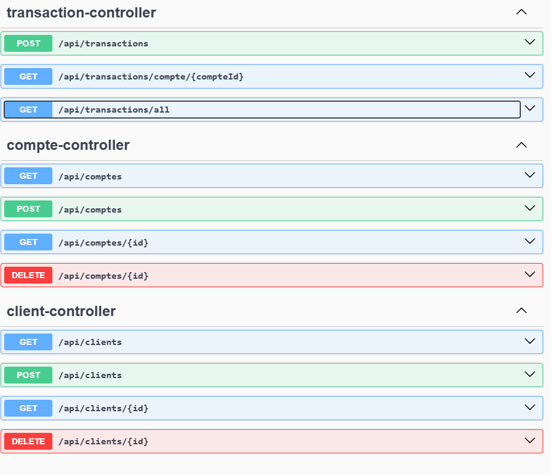

# Projet E-Bank

## Description

Ce projet représente une application bancaire permettant de gérer des comptes, des transactions (dépôts, retraits, virements) et des clients. Il a été développé en utilisant Spring Boot pour le backend, et il permet de simuler des transactions bancaires, d'effectuer des opérations sur des comptes, et de gérer l'enregistrement des clients et des comptes.

## Fonctionnalités

